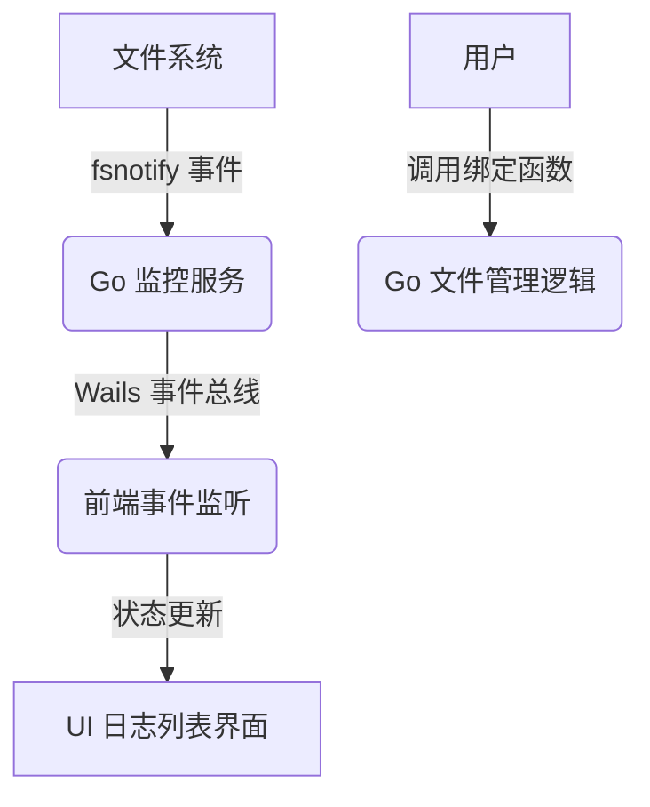

# 设计：文件监控系统 (Go + Wails)

## 架构概览

Wails 桥接了 Go 后端和 Web 前端。

### 组件设计

#### 1. 前端 (Vite + Vue/React)

- **UI 架构**：标准的 Web 应用结构。
- **样式**：Tailwind CSS 或原生 CSS，利用 `backdrop-filter: blur()`。
- **Wails 运行时**：通过 `EventsOn` 接收来自后端的实时文件事件。

#### 2. 后端 (Go)

- **应用结构**：`App` 结构体负责生命周期管理和系统绑定。
- **监控服务**：核心逻辑基于 `github.com/fsnotify/fsnotify`。
- **Win11 集成**：通过 `options.Windows` 配置开启 Mica/Acrylic 效果。

## 数据流向

## 视觉视觉系统

- **窗口背景**：`wails.WindowTranslucency` (Mica/Acrylic)。
- **主题适配**：自动检测并适配系统深色/浅色模式。
- **字体**：优先使用 Windows 11 系统字体（Segoe UI Variable）。
